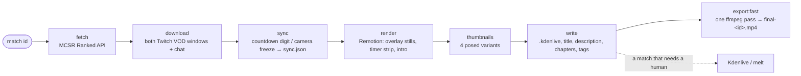
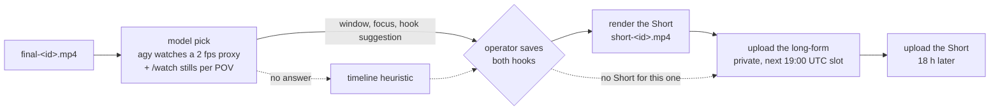

# mcsr-vid

[](https://github.com/Tymonoman/mcsr-vid/actions/workflows/ci.yml)

Turns an [MCSR Ranked](https://mcsrranked.com) match id into a finished race video for the
YouTube channel [MCSR Replayoffs](https://www.youtube.com/channel/UCm2mAyONTHlmIxZzNmi388w).
It pulls the match, the players and their head-to-head from the MCSR Ranked API, downloads
both players' Twitch VODs, lines the two POVs up on the pre-match countdown, and puts a
split-timer overlay over them. Each match produces:

- `final-<id>.mp4`: 1080p60, both POVs side by side, the overlay, a 7 s intro card and the
  subscribe card at the end. For a match that needs a human there is `match-<id>.kdenlive`
  as well.
- four thumbnail variants, the title, description, chapters and tags
- a vertical Short of the match's best moment
- for a playoff series, every game joined into one video (`series-<g1>.mp4`)

A web dashboard runs the morning: check the sync, save the hooks, upload, then finish the
upload on YouTube. The nightly renders one match at 03:00 UTC without anyone pressing a button.

## The pipeline



`npm run generate-project` runs every stage up to `write`, and `npm run export:fast` produces
the MP4 (it renders first when it has to). Each stage reuses what is already in
`<mediaDir>/<id>/`. The match footage is never cut. When the detector cannot read a clip's
countdown, the dashboard's "Fix the sync by hand" fold settles it, and the fix needs a
re-export rather than a re-render. `CLAUDE.md` explains what each file does and where the
pipeline tends to go wrong.

## The Short



1. **Model pick** (`src/shorts/videoPick.ts`). Antigravity's `agy` (`reasonerCommand`) watches
   the whole match and returns one continuous window of 12 to 60 s, which side to focus on, a
   hook suggestion and a one-line reason. If it gives no answer, the old timeline heuristic
   (`src/shorts/shortMoment.ts`) picks instead and `short-<id>.pick-error.json` records why.
   `npm run pick -- <id> --force` asks the model again.
2. **The operator's hooks.** Nothing renders or uploads until the hooks are saved on the
   dashboard. The title hook becomes the long-form's title and the Short hook goes into
   `short-<id>.hook.txt`. Both fields are prefilled with the model's suggestion.
3. **Render and upload** (`src/dashboard/shortFlow.ts`). Once the hooks are saved, the chain
   renders the Short, uploads the long-form at its publish slot and uploads the Short 18 h
   later. The uploads only happen while `youtubeUploadEnabled` and `nightlyUpload` allow them.
   After the upload the hooks lock. `short-<id>.status.json` records the state of each step.

## Running it

Requirements: Node 24 (what the image and CI run), `ffmpeg`/`ffprobe` and
[`yt-dlp`](https://github.com/yt-dlp/yt-dlp) on `PATH`, and `python3` for `/watch` and
`npm run analytics`. You only need MLT (`melt-7`) to open or validate a Kdenlive project.
`Dockerfile` + `compose.yaml` define the lab's image: one container you exec into, and
`mcsr-dashboard`.

```sh
npm install
cp mcsr-vid.config.example.json mcsr-vid.config.json   # optional: any subset of keys
npm run dashboard                                      # http://localhost:8080
```

Commands accept a match id or a match page URL. Extra arguments go after `--`.

| Script | What it does |
| --- | --- |
| **Everyday** | |
| `dashboard` | The web dashboard (`PORT`, default 8080). It also schedules the nightly render at `nightlyRenderHourUtc`. |
| `start` | The terminal UI. |
| `export:fast -- <id> [--cpu] [--seconds=N]` | The finished MP4 in one ffmpeg pass (VAAPI on the lab, `--cpu` otherwise). |
| `short -- <id> [--at=<ms>] [--seconds=N]` | The Short from the pick's window. It refuses to run without the operator's hook. |
| `pick -- <id \| all> [--force]` | Ask the model for the Short's window and print the prompt, the answer and the pick. |
| `series -- <id \| all> [--join-only]` | A playoff series as one video. |
| **Pipeline stages** | |
| `fetch-match -- <id>` | Print the match, both players and their head-to-head from the MCSR Ranked API as JSON. |
| `download-vods -- <id>` | Both POV windows and the chat. Twitch deletes most archives after 14 days, so run it early. |
| `validate-sync -- <id>` | Check or refine the alignment and render a preview clip. |
| `render-overlay -- <id>` | The overlay stills, the timer strip and the intro. |
| `generate-thumbnail -- <id>` | The default-pose thumbnail only. |
| `generate-project -- <id>` | Every stage up to the `.kdenlive` project and the text. |
| `batch -- <file>` | The full pipeline for each id listed in the file, one per line. |
| **Inspecting** | |
| `status` | A table of each match's stages in the media directory. |
| `score -- <id>` | Split-by-split breakdown and the closeness/chaos score. |
| `sync-status -- [id]` | Where each match's POV clips are placed. Given an id, it backfills `sync.json` from the project. |
| `chat -- <id>` | Fetch both players' Twitch chat if the pipeline saved none. |
| `retention -- <videoId>…` | The audience retention curve per video (YouTube Analytics). |
| `analytics -- <videoId>` | YouTube Analytics through the claude-youtube skill, which lives outside this repo. |
| `still -- <Composition> <out.png>` | Render one Remotion frame to PNG for a quick visual check. |
| `remotion:studio` | Remotion Studio, for previewing the compositions. |
| `bench -- <Composition>` | Render throughput for one composition. |
| `validate-project -- <file.kdenlive>` | Load a generated project through MLT. Exit code 0 means it parses. |
| `export:nvenc -- <file.kdenlive>` | melt + `h264_nvenc`, which needs an NVIDIA GPU. |
| **Setup and upkeep** | |
| `youtube-auth` | One-time OAuth consent. Writes `youtube-token.json`. |
| `config:example` | Regenerate `mcsr-vid.config.example.json` from `DEFAULTS` in `src/config.ts`. |
| `archive -- <id>` | Copy a finished match to the NAS with rsync. Nothing is deleted. |
| `build-overlay-css` | Rebuild `remotion/overlay.css`. The render scripts run it themselves. |
| `typecheck` / `format` | `tsc --noEmit` / prettier. |
| `test:unit` / `test` | Every `*.test.ts` except the two that drive Chromium and ffmpeg / all of them. |

## Credentials

| Part | Needs | Where |
| --- | --- | --- |
| Match data (MCSR Ranked API) | nothing, public (about 500 requests per 10 min) | |
| VODs (yt-dlp) and chat (Twitch web GQL) | nothing | |
| The follower signal in match suggestions | `TWITCH_CLIENT_ID`, `TWITCH_CLIENT_SECRET` (optional: without them it counts how often a player turns up streaming) | `.env` |
| The Short's model pick | `agy` installed and signed in (`reasonerCommand`). On the lab: its own HOME in `.tools/agy-home`, or `GEMINI_API_KEY`. Optional: without it the heuristic picks | `.tools/`, `.env` |
| `/watch` transcripts for the pick | `GROQ_API_KEY` or `OPENAI_API_KEY` (optional: stills only without one) | `.env` |
| YouTube: upload, finish, pairing, retention | an OAuth client (`YOUTUBE_CLIENT_SECRETS`, default `~/.claude/youtube_client_secrets.json`), then `npm run youtube-auth` to write `youtube-token.json` (`YOUTUBE_TOKEN_FILE`). Uploads also need `youtubeUploadEnabled` | repo root, config |
| `npm run analytics` | the claude-youtube skill's own token and its Python packages | `~/.claude/` |
| Nightly notifications | `nightlyNotifyUrl` | config |
| Tests and CI | nothing | |

`.env`, `mcsr-vid.config.json`, `youtube-token.json` and `.tools/` are gitignored.
`scripts/preflight.sh` warns when a credential is missing or about to expire.

## Tests and CI

The tests are plain assertion scripts with no framework, each next to the file it tests.
`npm run test:unit` runs all but two, and `npm test` adds those two (they drive Chromium and
ffmpeg). To run a single test: `npx tsx src/pipeline/kdenliveProject.test.ts`.
`bash scripts/browser-checks/run-all.sh <url>` drives a real dashboard in Playwright.
[CI](.github/workflows/ci.yml) runs `tsc --noEmit` and `npm run test:unit` on every push and
pull request, with no secrets.

## Layout

```
src/
  api/          MCSR Ranked and Twitch clients, the API types, avatar renders
  pipeline/     a match to a video: fetch, VODs, sync, overlay, project, export, the text
  thumbnails/   the variant strip
  shorts/       the model pick, /watch, the heuristic, the vertical render
  playoffs/     the bracket and its games; a series as one video
  youtube/      the Data API client and auth, uploads, the channel pairing, the publish slot
  dashboard/    the server, its routes, the Short chain, jobs, the nightly, suggestions
  cli/          batch, status, score, chat, bench, retention, the TUI
  fixtures/     saved API responses the tests read
remotion/       the overlay, intro, thumbnail and Short compositions (React + Remotion)
public/         the dashboard's browser files, served from disk (no build step)
scripts/        browser checks, the overlay CSS build, preflight, the subreaper
handbook/       for the operator: the Studio routine, the API review, the domain
branding/       the logo and banner and their generator
docs/           the GitHub Pages site for mcsr.sezamki.site (OAuth homepage, privacy, terms)
deploy/         the lab's systemd user unit
```

Start with the doc for your role:

- **[CLAUDE.md](CLAUDE.md)**: for agents and for anyone changing the code. It has the house
  rules (no spoilers, the footage is never cut, nothing irreversible without the operator),
  what each render produces, the dashboard's design and the known pitfalls.
- **[handbook/](handbook/README.md)**: for the operator. It covers running the channel: the
  Studio routine, the YouTube API compliance review and the domain.
